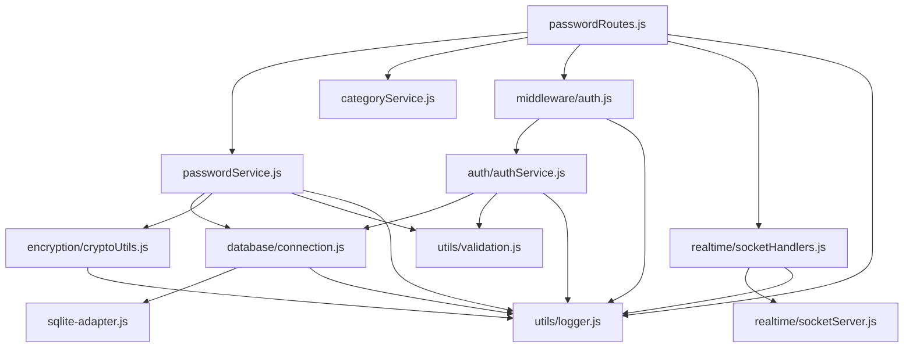

# Dependency Analysis Report
**Generated**: 2025-07-09  
**Purpose**: Modularity improvement foundation analysis

## 🔍 Current Module Dependencies

### **Core Server Modules**

#### **1. Authentication Module (`src/server/auth/`)**
```
authService.js
├── database/connection.js (query, transaction)
├── utils/validation.js (validateEmail, validatePassword, validateName)
├── utils/logger.js (logger, authLog, auditLog)
├── bcryptjs (password hashing)
└── jsonwebtoken (JWT operations)

authRoutes.js
├── authService.js (all auth functions)
├── middleware/auth.js (authenticateToken, requireAdmin)
├── utils/validation.js (validation functions)
├── utils/logger.js (logging functions)
├── services/mockAuth.js (testing)
└── express-rate-limit (rate limiting)
```

#### **2. Password Module (`src/server/passwords/`)**
```
passwordService.js
├── database/connection.js (query, transaction)
├── encryption/cryptoUtils.js (encryptPassword, decryptPassword, encryptData, decryptData)
├── utils/validation.js (validatePasswordEntry, validatePagination, validateSearchQuery)
└── utils/logger.js (passwordLog, auditLog)

passwordRoutes.js
├── passwordService.js (all password functions)
├── categoryService.js (all category functions)
├── middleware/auth.js (authenticateToken, requireAdmin)
├── utils/logger.js (auditLog)
├── realtime/socketHandlers.js (broadcast functions) ⚠️ TIGHT COUPLING
├── services/mockAuth.js (testing)
└── express-rate-limit (rate limiting)
```

#### **3. Real-time Module (`src/server/realtime/`)**
```
socketServer.js
├── auth/authService.js (findUserById)
├── utils/logger.js (logger)
├── jsonwebtoken (JWT verification)
└── socket.io (WebSocket server)

socketHandlers.js
├── utils/logger.js (auditLog, systemLog)
└── socketServer.js (broadcast functions)
```

#### **4. Database Module (`src/server/database/`)**
```
connection.js
├── utils/logger.js (logger)
├── sqlite-adapter.js (SQLite operations)
└── pg (PostgreSQL operations)

sqlite-adapter.js
├── better-sqlite3 (SQLite driver)
└── utils/logger.js (logger)
```

#### **5. Utility Modules (`src/server/utils/`)**
```
logger.js
├── winston (logging framework)
└── fs (file system operations)

validation.js
└── joi (validation library)

cryptoUtils.js
├── crypto (Node.js crypto)
└── utils/logger.js (logger)
```

## 🚨 Identified Coupling Issues

### **1. Tight Coupling: Routes → Real-time**
**Location**: `src/server/passwords/passwordRoutes.js`
```javascript
// PROBLEM: Direct import of real-time functionality
const {
  broadcastPasswordCreated,
  broadcastPasswordUpdate,
  broadcastPasswordDeleted
} = require('../realtime/socketHandlers');

// PROBLEM: Direct access to Socket.io instance
const io = req.app.get('io');
if (io) {
  broadcastPasswordCreated(io, createdPassword, req.user.userId);
}
```
**Impact**: Password routes cannot function without real-time system

### **2. Global State Dependency: Express App Object**
**Location**: `src/server/app.js` and route files
```javascript
// PROBLEM: Global state injection
app.set('io', io);

// PROBLEM: Routes depend on app-level state
const io = req.app.get('io');
```
**Impact**: Hidden dependencies, difficult testing, tight coupling

### **3. Mixed Responsibilities: Routes Handle Multiple Concerns**
**Location**: `src/server/passwords/passwordRoutes.js`
```javascript
// PROBLEM: Routes handle both passwords AND categories
const {
  createPasswordEntry,
  getPasswordEntries,
  // ... password functions
} = require('./passwordService');
const {
  getPasswordCategories,
  getCategoryById,
  // ... category functions  
} = require('./categoryService');
```
**Impact**: Changes to either system affect the same route file

### **4. Direct Service Dependencies**
**Location**: Multiple service files
```javascript
// PROBLEM: Services directly import each other
const { query, transaction } = require('../database/connection');
const { encryptPassword, decryptPassword } = require('../encryption/cryptoUtils');
```
**Impact**: Services are tightly bound to specific implementations

## 📊 Dependency Graph



## 🎯 Refactoring Priorities

### **Priority 1: HIGH RISK - Immediate Attention**
1. **Decouple Real-time from Routes**
   - Risk: Breaking real-time functionality
   - Impact: All password operations
   - Solution: Event-driven architecture

2. **Remove Global State Dependencies**
   - Risk: Hidden dependencies
   - Impact: Testing and maintainability
   - Solution: Dependency injection

### **Priority 2: MEDIUM RISK - Next Phase**
3. **Separate Route Responsibilities**
   - Risk: Feature conflicts
   - Impact: Password and category features
   - Solution: Dedicated route modules

4. **Abstract Service Dependencies**
   - Risk: Implementation lock-in
   - Impact: Database and encryption changes
   - Solution: Interface abstractions

### **Priority 3: LOW RISK - Future Enhancement**
5. **Configuration Centralization**
   - Risk: Configuration drift
   - Impact: Environment management
   - Solution: Configuration service

6. **Logging Standardization**
   - Risk: Inconsistent logging
   - Impact: Debugging and monitoring
   - Solution: Structured logging service

## 🔧 Recommended Refactoring Approach

### **Phase 1: Event-Driven Decoupling**
```javascript
// BEFORE (Tight Coupling)
const io = req.app.get('io');
broadcastPasswordCreated(io, createdPassword, req.user.userId);

// AFTER (Event-Driven)
eventBus.emit('password.created', {
  password: createdPassword,
  userId: req.user.userId
});
```

### **Phase 2: Dependency Injection**
```javascript
// BEFORE (Direct Import)
const { query } = require('../database/connection');

// AFTER (Dependency Injection)
class PasswordService {
  constructor(database, encryption, validation, logger) {
    this.database = database;
    this.encryption = encryption;
    this.validation = validation;
    this.logger = logger;
  }
}
```

### **Phase 3: Service Interfaces**
```javascript
// BEFORE (Concrete Implementation)
const passwordService = require('./passwordService');

// AFTER (Interface-Based)
const passwordService = serviceRegistry.get('passwordService');
```

## ✅ Success Metrics

### **Coupling Reduction Targets**
- **Current**: 15+ direct dependencies per route
- **Target**: 3-5 injected dependencies per route
- **Measurement**: Dependency count analysis

### **Testability Improvement**
- **Current**: Heavy mocking required
- **Target**: Isolated unit testing
- **Measurement**: Test complexity reduction

### **Maintainability Enhancement**
- **Current**: Changes affect multiple modules
- **Target**: Single responsibility changes
- **Measurement**: Change impact analysis

## 📋 Implementation Checklist

### **Immediate Actions (Phase 1)**
- [ ] Create event bus system
- [ ] Implement password event handlers
- [ ] Remove direct real-time imports from routes
- [ ] Add event emission to password operations
- [ ] Test real-time functionality with events

### **Next Steps (Phase 2)**
- [ ] Create dependency injection container
- [ ] Define service interfaces
- [ ] Implement service factories
- [ ] Update service constructors
- [ ] Migrate route dependencies

### **Future Enhancements (Phase 3)**
- [ ] Create service registry
- [ ] Implement configuration service
- [ ] Add health check system
- [ ] Create monitoring interfaces
- [ ] Document new architecture

This analysis provides the foundation for safe, incremental modularity improvements while maintaining all existing functionality.
